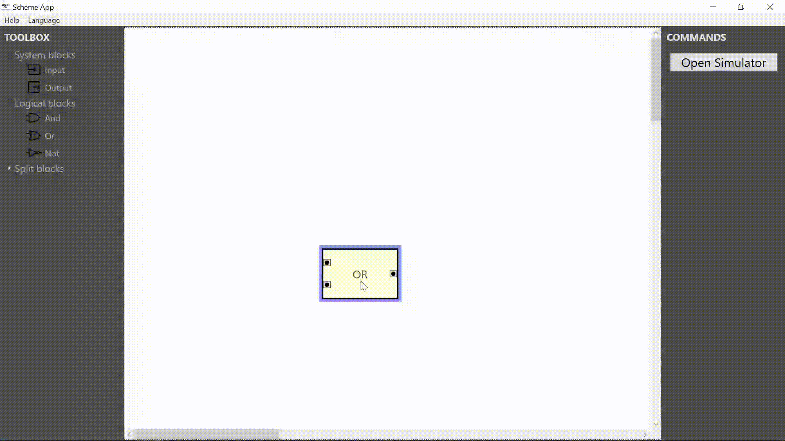
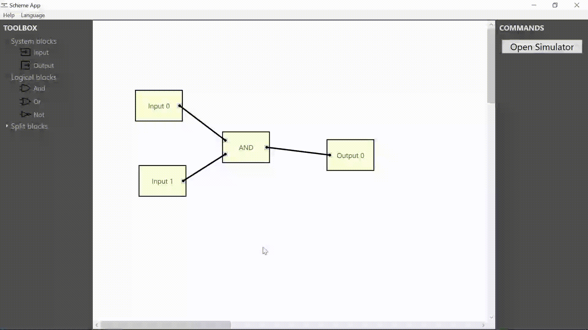
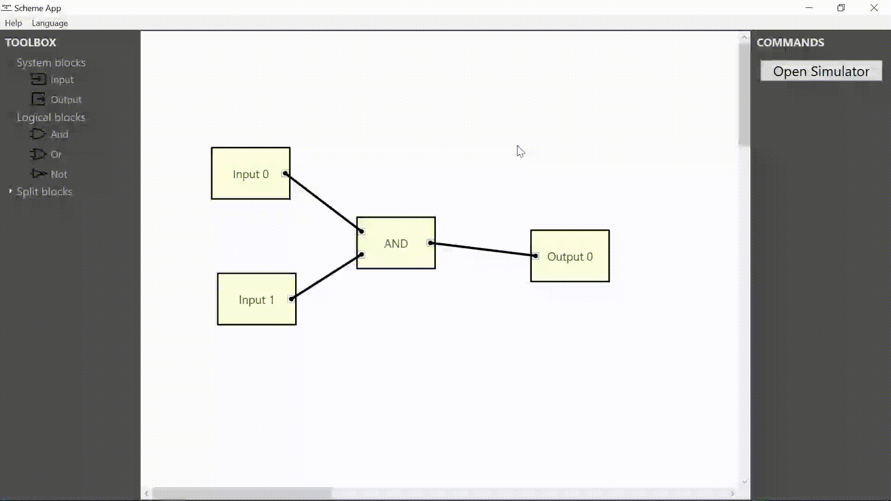

<h1>Table of content</h1>

1. [About](#about)
2. [Setup](#setup)
3. [How to use](#how-to-use)
4. [Features](#features)
    1. [Creating blocks and connections](#1-creating-blocks-and-connections)
    2. [Moving and deleting blocks](#2-moving-and-deleting-blocks)
    3. [Scrolling](#3-scrolling)
    4. [Scaling](#4-scaling)
    5. [Language changing](#5-language-changing)
5. [Example](#example)

# About

- **Project name:** Scheme Application
- **Platforms:** Windows
- **Language:** C# .NET 8.0
- **Framework:** Windows Presentation Foundation

---

It's an application for **creating and simulating** electronic logic schemes. You can create and connect logical blocks(such as AND, OR and NOT), as well as splitters and the scheme's inputs and outputs. You can then simulate your scheme by entering data and viewing the output data in a table.

This is a program developed as part of a coursework for the second semester of the second year.

# Setup

1. Download the [SetupApp](SetupApp.msi) installer;
2. Install in your directory;
3. Open the program.

# How to use

- **Select an element:** Left mouse button(LMB)
- **Delete an element:** Delete
- **Zoom in:** Ctrl++
- **Zoom out:** Ctrl+-

1. **To drag a block** - select it and hold down *LMB*.
2. **To create a block** - select a block in the TOOLBOX menu and left-click on the workspace where you want to create this block.
3. **To create connections** - select the output (input) pin on the first block and click on the input (output) pin on the second block.
4. Use the horizontal and vertical scroll bars **to move on the workspace**.

# Features

## 1. Creating blocks and connections

## 2. Moving and deleting blocks

## 3. Scrolling

## 4. Scaling

## 5. Language changing

**Available in English and Ukrainian**

# Example

**This is an example of an XOR element.**
